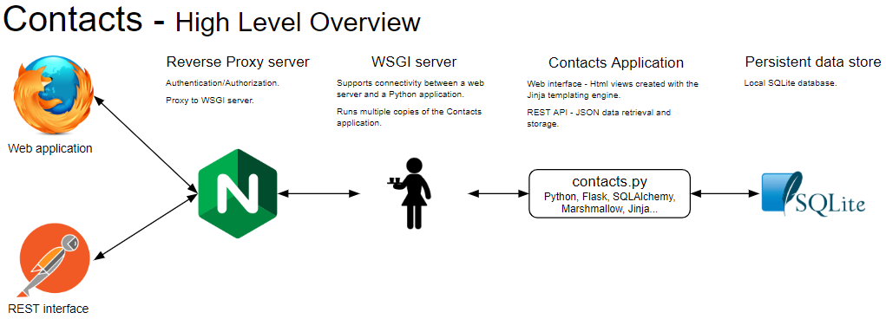

# Python web service example
This is a learning example web application using Python, Flask, SQLAlchemy, Marshmallow and Jinja.



## Setup cheat sheet

### Setup a virtual environment
```bash
python -m venv env    # One time environment creation
env\Scripts\activate  # Activate the environment in a new shell
```

### Install Libs
```bash
pip install flask flask-sqlalchemy flask_marshmallow...  # Not a comprehensive list of libs
```

### Freeze (and use) lib requirements
```bash
pip freeze > requirements.txt     # Write libs to a requirements.txt file. Run after adding or updating libs.
pip install -r requirements.txt   # Install libs after a git clone or pull of updated requirements.txt
```

### Initialize the sqlite database
In the shell:
```
python
>>> from app import db, Person
>>> from datetime import datetime
>>> db.create_all()

# Optionally seed some data

fred =   Person(firstNme='Fred',  lastNme='Flintstone', street='345 Cave Stone Rd', city='Bedrock', state='NA', zip='123', phone='1', email='fred@bedrock.com',  birthday=datetime.fromisoformat('1970-01-01'))
wilma =  Person(firstNme='Wilma', lastNme='Flintstone', street='345 Cave Stone Rd', city='Bedrock', state='NA', zip='123', phone='1', email='wilma@bedrock.com', birthday=datetime.fromisoformat('1970-02-01'))
barney = Person(firstNme='Barney',lastNme='Rubble',     street='123 Granite St',    city='Bedrock', state='NA', zip='123', phone='2', email='barney@bedrock.com',birthday=datetime.fromisoformat('1970-03-01'))
betty =  Person(firstNme='Betty', lastNme='Rubble',     street='123 Granite St',    city='Bedrock', state='NA', zip='123', phone='2', email='betty@bedrock.com', birthday=datetime.fromisoformat('1970-04-01'))

db.session.add(fred)
db.session.add(wilma)
db.session.add(barney)
db.session.add(betty)
db.session.commit()

Person.query.all()

>>> exit()
```

## Some libs used
[Flask-SQLAlchemy](https://flask-sqlalchemy.palletsprojects.com/)

[SQLAlchemy](https://sqlalchemy.org/) which is comprised of [ORM and Core](https://docs.sqlalchemy.org/en/13/)

[Flask-Marshmallow](https://flask-marshmallow.readthedocs.io/)

[Marshmallow](https://marshmallow.readthedocs.io/)

## Notes
### Library/Dependency  management
`pip list --outdated` will list libs that are installed from requirements.txt and have updates available. *It will also list system level libs that are out of date! waitress is in the output even though it's not in the virtual environment or requirements.txt.*
```bash
$ pip list --outdated
Package                Version Latest Type
---------------------- ------- ------ -----
flask-marshmallow      0.10.1  0.11.0 wheel
Jinja2                 2.10.3  2.11.1 wheel
marshmallow            3.3.0   3.4.0  wheel
marshmallow-sqlalchemy 0.21.0  0.22.2 wheel
six                    1.13.0  1.14.0 wheel
SQLAlchemy             1.3.11  1.3.13 sdist
waitress               1.4.1   1.4.3  wheel
Werkzeug               0.16.0  1.0.0  wheel
```

`pip-outdated` is a library/cli available that is a little more `npm` like.
```bash
$ pip-outdated
Red = unavailable/outdated/out of version specifier
Green = updatable
+------------------------+-----------+--------+--------+
| Name                   | Installed | Wanted | Latest |
+------------------------+-----------+--------+--------+
| flask-marshmallow      | 0.10.1    | 0.10.1 | 0.11.0 |
| Jinja2                 | 2.10.3    | 2.10.3 | 2.11.1 |
| marshmallow            | 3.3.0     | 3.3.0  | 3.4.0  |
| marshmallow-sqlalchemy | 0.21.0    | 0.21.0 | 0.22.2 |
| six                    | 1.13.0    | 1.13.0 | 1.14.0 |
| SQLAlchemy             | 1.3.11    | 1.3.11 | 1.3.13 |
| Werkzeug               | 0.16.0    | 0.16.0 | 1.0.0  |
+------------------------+-----------+--------+--------+
```

What I did was hand edit the requirements.txt file to the latest versions. Reran `pip-updated` to ensure Wanted === Latest. Then ran
```bash
pip install -U -r requirements.txt
[pip install output here!]

$ pip-outdated
Everything is up-to-date!

$ pip list --outdated
Package  Version Latest Type
-------- ------- ------ -----
waitress 1.4.1   1.4.3  wheel

$ pip install -U waitress
Collecting waitress
  Downloading waitress-1.4.3-py2.py3-none-any.whl (148 kB)
     |████████████████████████████████| 148 kB 6.4 MB/s
Installing collected packages: waitress
  Attempting uninstall: waitress
    Found existing installation: waitress 1.4.1
    Uninstalling waitress-1.4.1:
      Successfully uninstalled waitress-1.4.1
Successfully installed waitress-1.4.3
```

Then I reran `pip list --outdated` to confirm that everything is up to date.